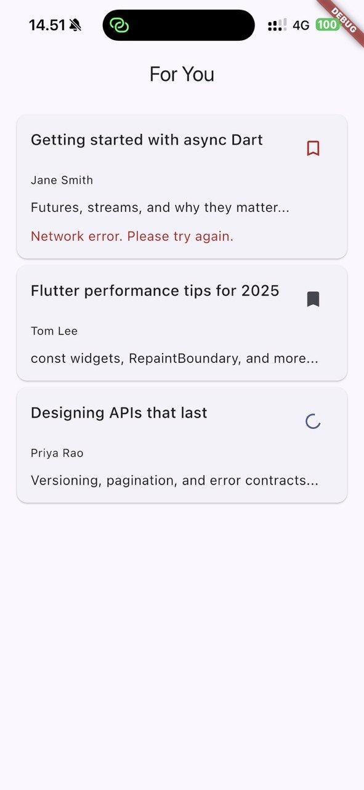

# Part 2 - API Design

Before go to how it's saved in the API, the schema would be like this:

Author {  
  id: UUIDV7 primary key  
  name: string  
  dateOfBirth: DATE  
  address: string  
  nickname: string

  createdAt: Timestamp   
  updatedAt: Timestamp   
  UNIQUE (name, dateOfBirth, nickname)  
}  
Note: address could change, but nickname does not

Article {    
  id: UUIDV7 primary key    
  author: Reference    
  title: string   
  preview: string   
  
  createdAt: Timestamp, default now()   
  updatedAt: Timestamp    
  deletedAt: Timestamp    
}

User {   
  id: UUIDV7 primary key   
  name: string   
  username: string unique   
  password: string   
   
  createdAt: Timestamp default now()   
  updatedAt: Timestamp  
}

SaveArticle {  
  id: UUIV7 primary key   
  userId: Reference from User    
  articleId: Reference from Article    
  savedAt: Timestamp, default now()    
}

For saving article: POST /articles/{articledId}/saves We're gonna get the userId from the authorization token And then save it to SaveArticle by combining the userId and articleId,

For unsaving article: DELETE /articles/{articleId}/saves. Fetch the userId from the authorization token and delete the SavedArticle row from the db with the same userId and articleId

If the server received the same article twice, the database would not allow multiple inserts, but the server should send a 200 Success message to the client because it's a successful save anyway (data is saved)

If the article is deleted, we make it a soft delete so that we can still store the SaveArticle row, and on the frontend, we can display it to the user that this article has been deleted, so that it does not just disappear and make the user freak out

# Part 3 - My Thinking

I'm using blocs for state management because it's common knowledge that blocs scale easily. The structure is strict, but great. Debugging could be easy, more teamwork-friendly, but has a lot of boilerplate code, since now it's the AI era, where AI can write good boilerplate code, the main downside is gone.

"Unsave" behavior, the spec only mentioned saving articles, but I assume that the user should also be able to unsave them. Because if users can save, they should also be able to unsave. Of course, this is a great discussion for the team because it will directly affect how users feel about the app

I don't apply optimistic update behaviour, because the spec specifies to show the loading -> error | loading -> success, so I just make the loading indicator appear clearly, not hidden under optimistic UI update.

I also don't write the domain logic even though it's a good behavior and one of clean architecture key parts, but it's unnecessary at this point. same reason as I don't write screens

What I would add, or change, is the article_save_unsave_bloc. Currently, it's tied to ArticleCard, but when the code becomes bigger, and another widgets want to use saved articles information like "Amount of saved on SavedArticles nav icon button" we could move the bloc higher

# Demo screenshot

